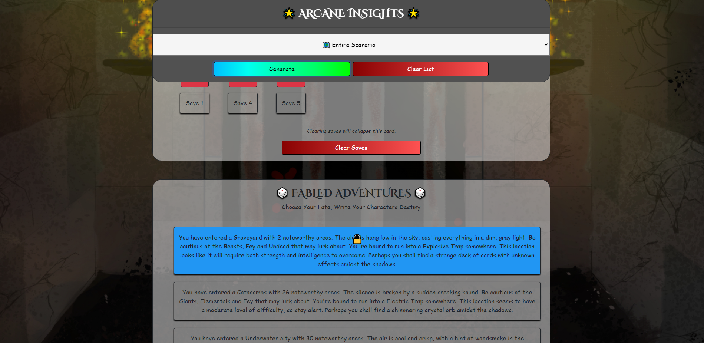
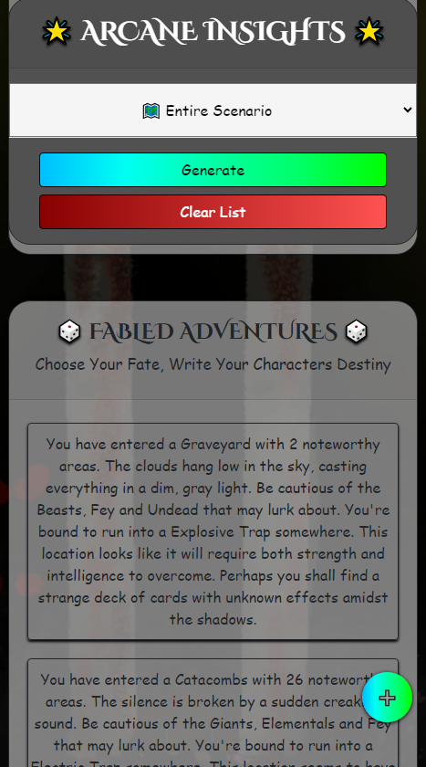

[](https://opensource.org/licenses/MIT)


<h1 align="center">
  Unleash Your Creativity With Our Dungeon Generator!
</h1>

:computer: **Live Deployment**: https://jwilferd10.github.io/Adventure-Alchemist/

:computer: **Github Repository**: https://github.com/jwilferd10/Adventure-Alchemist

## :open_file_folder: Table of Contents:
  - [Preview](#camera-preview)
  - [Demo](#movie_camera-demo)
  - [Description](#wave-description)
  - [User Story](#book-user-story)
  - [Resources Used](#floppy_disk-resources-used)
  - [Getting Started](#minidisc-usage)
  - [Contact Information](#e-mail-contact-information)

## :camera: Preview:
<p float="left">
  
  
</p>

## :movie_camera: Demo:


## :wave: Description: 
Adventure Alchemist is an application with an aim to help make the process of generating dungeon scenarios for your tabletop RPGs, specifically DnD campaigns, easier and more accessible. This app utilizes a variety of algorithms and user preference to create, save and recall unique scenarios for the user. When generating a scenario the application takes into account various factors such as dungeon theme, size, and difficulty. 

With Adventure Alchemist, both dungeon masters and players can swiftly conjure up imaginative and enthralling scenarios, injecting a fresh dose of excitement into their campaigns. This dynamic tool ensures gameplay remains engaging and invigorating.

Thanks so much for checking out Adventure Alchemist! The development journey of Adventure Alchemist has been a culmination of insights and lessons drawn from previous projects. Overcoming challenges, including nuances with localStorage and unique identifier issues, has been an integral part of refining the application. This project was also a  commission and I received the green-light to keep this repository public for everyone to use. I devoted time into ensuring the code is modularized and easily modifiable. It's my hope that this application helps YOU out in anyway possible. Feel free to take a look through the files and fork it if you'd like, Happy Coding!

## :book: User Story:
**AS A Dungeon Master for a DnD Campaign**
- I WANT to be able to generate random dungeon scenarios quickly and easily
    - SO THAT I can have engaging and varied gameplay experiences without spending a lot of time planning.
- I WANT to have the ability to customize the generated scenarios based on party level, dungeon size, and theme
    - SO THAT I can create scenarios that best fit my campaign and preferences.
- I WANT to be able to save my generated scenarios
    - SO THAT I can easily access them later and reuse them for future gameplay sessions.
- I WANT the app to provide me with detailed descriptions of the generated scenarios, including enemies, loot, and traps
    - SO THAT I can better plan my strategy and tactics in advance.
- I WANT to be able to easily share the generated scenarios with other players in my campaign
    - SO THAT we can collaborate and discuss our approach to the scenarios.
- I WANT to be able to access the generated scenarios offline
    - SO THAT I can use them even when I don't have an internet connection available.

**GIVEN a Dungeon Scenario Generator**
- WHEN I input party level, dungeon size, and theme preferences
  - THEN I click 'Generate'
  - THEN I am presented with a unique and randomized dungeon scenario that fits my preferences
  - THEN I can save the scenario for later use or generate a new one
  
## :floppy_disk: Resources Used:
- HTML
- CSS
- JavaScript
- Bootstrap5

## :minidisc: Usage:
To use Adventure Alchemist:

1. Select your preferenced content to generate
2. Click the 'Generate' button
3. Review the generated scenario details
4. Optionally, click the 'generate' button again to generate a new scenario with the same preferences

Repeat steps 1-4 as desired

### Running Locally

To run the Adventure Alchemist app locally, you can use a tool like `http-server`. If you haven't already installed it, you can install it globally using npm:

```bash
npm install -g http-server
```

After installing, navigate to the root directory of your Adventure Alchemist project and run the following command:

```
http-server -p 3000 --cors --module
```
This will start an HTTP server that serves Adventure Alchemist on port 3000. You can then access the app by opening your web browser and navigating to `http://localhost:3000`.

Please note that the provided command assumes you have `Node.js` and `npm` installed on your system.
  
## :e-mail: Contact Information:
- ### [jwilferd10](https://github.com/jwilferd10)
